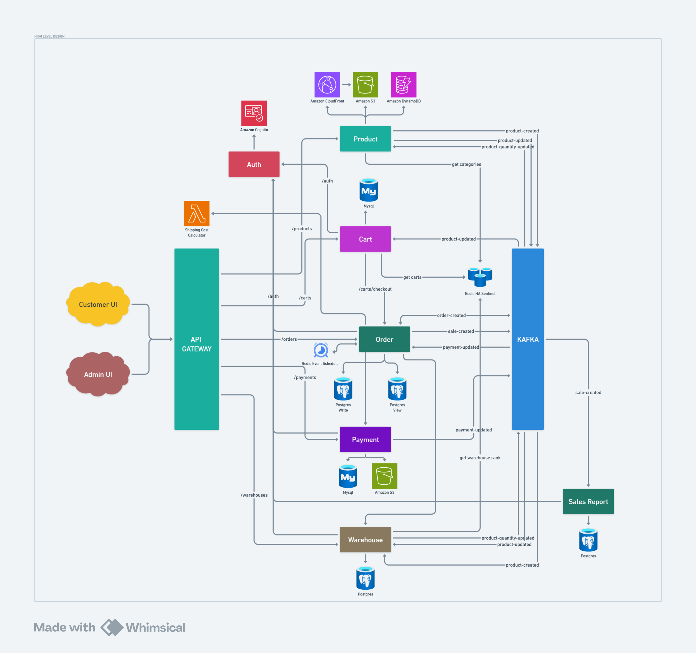

**Eshop** is a cloud microservices application. The application is a web-based e-commerce app where users can find cars or motorcycle, add them to the cart, and purchase them.
This application combining the service from Amazon Web Service and Google Cloud Platform.

## Architecture

| Service                                                            | Language   | Framework   | Database     | Publisher                        | Subscriber                       | Description                                                                                              |
|--------------------------------------------------------------------|------------|-------------|--------------|----------------------------------|----------------------------------|----------------------------------------------------------------------------------------------------------|
| [Frontend Customer](https://github.com/idoyudha/eshop-fe-customer) | Typescript | NextJS      | -            | -                                | -                                | Expose an HTTP server to serve the website for user. Does not require signup/login to see all product.   |
| [Frontend Admin](https://github.com/idoyudha/eshop-fe-admin)       | Typescript | NextJS      | -            | -                                | -                                | Expose an HTTP server to serve the website for admin. Require signup/login to perform all actions.       |
| [Auth](https://github.com/idoyudha/eshop-auth)                     | Go         | Gin         | -            | -                                | -                                | Auth service to perform centralize authorization for all internal service.                               |
| [Cart](https://github.com/idoyudha/eshop-cart)                     | Go         | Gin         | Redis, MySQL | -                                | product-updated                  | Cart service for user saving cart and get their current cart.                                            |
| [Order](https://github.com/idoyudha/eshop-order)                   | Go         | Gin         | PostgresSQL  | order-created, sale-created      | order-created, payment-updated   | Order service to process ordering after user add items to the cart and fill address detail.              |
| [Payment](https://github.com/idoyudha/eshop-payment)               | Java       | Spring Boot | Mysql, S3    | payment-updated                  | -                                | Payment service that will receive the payment proof from user, then admin will validate it.              |
| [Product](https://github.com/idoyudha/eshop-product)               | Go         | Gin         | DynamoDB, S3 | product-created, product-updated | product-quantity-updated         | Product service that will show the all the list of product and the detail also with stock.               |
| [Sales Report](https://github.com/idoyudha/eshop-sales-report)     | Python     | FastAPI     | PostgresSQL  | -                                | sale-created                     | Reporting service                                                                                        |
| [Shipping Cost](https://github.com/idoyudha/eshop-shipping-cost)   | Python     | -           | -            | -                                | -                                | API for calculating the cost based on the zipcode differences, running with AWS Lambda                   |
| [Warehouse](https://github.com/idoyudha/eshop-warehouse)           | Go         | Gin         | PostgresSQL  | product-quantity-updated         | product-created, product_updated | Warehouse service handling movement between warehouse and movement to user, also get real stock of item. |

## Screenshots
| Home Page                      | Product Detail                           |
|--------------------------------|------------------------------------------|
|  |  |

| Add to Cart                           | Checkout                           |
|---------------------------------------|------------------------------------|
|  |  |

| Order List                           | Order Detail                           |
|--------------------------------------|----------------------------------------|
|  |  |

## Services
### Auth
- handled by amazon cognito requested with this service
### Product
#### Database: Dynamo DB and Google Cloud Storage for Image
- High read-to-write ratio (many customers viewing products)
- Need for fast product view by categories
- Flexible schema
- Easy to scale
### Cart
#### Database: Redis and MySQL
- great for active cart, use will read heavy on this (act as primary storage)
- mysql just for persistence or recovery
- write is very low in mysql
### Order
#### Database: Postgres
- transaction, require strong consistency
### Payment
#### Database: MySQL
- schema simple and fixed
### Warehouse
#### Database: Postgres
- transaction
- better handling concurrent update
- better for complex query with many rows
### Sales Report
#### Database: Postgres
- great for complex analytics query
- good performance with large datasets
- built in time-series functionality
## Documentation
- [Development](/docs/development-guide.md) to learn how to run and develop this microservice locally or via Google Kubernetes Engine.
- [API Documentation](https://lh53ntuiw1.apidog.io) with password: *0ceNdUuG* (temporary)
## Contact
- Email: idowidya.yudhatama@gmail.com
- LinkedIn: https://linkedin.com/in/idoyudha